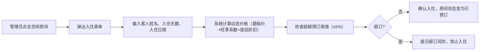
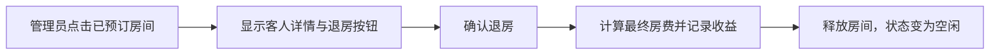
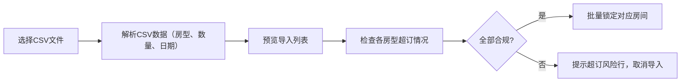

## 1. 产品概述

酒店房态管理与动态定价模拟器是一款面向酒店运营管理人员的桌面Web应用，用于可视化管理客房状态、执行动态定价策略、监控收益指标和处理团队预订。产品通过直观的网格界面和数据可视化，帮助酒店管理者优化入住率和收益表现。

- 目标用户：酒店前台管理人员、收益经理
- 核心价值：提供一站式房态管理与收益分析工具

## 2. 核心功能

### 2.1 用户角色

| 角色 | 注册方式 | 核心权限 |
|------|----------|----------|
| 酒店管理员 | 无需注册（本地应用） | 全部功能：房态管理、定价设置、报告查看、数据导入导出 |

### 2.2 功能模块

1. **房态管理面板**：房型总览、房间网格状态图、入住/退房操作
2. **动态定价设置**：基础价格配置、旺季日期范围与系数设置、提前预订折扣规则
3. **收益报告仪表盘**：RevPAR/ADR/入住率指标卡、30天趋势折线图
4. **预订管理**：CSV团队预订批量导入、超额预订风险监控
5. **数据管理**：JSON房态快照导出与恢复、未来7天预订热力图

### 2.3 页面详情

| 页面名称 | 模块名称 | 功能描述 |
|----------|----------|----------|
| 主仪表盘 | 顶部指标卡 | 展示今日RevPAR、ADR、入住率、在住客人数量 |
| 主仪表盘 | 房态网格 | 4种房型×10间房的可视化网格，绿色空闲/红色已订/黄色超订风险 |
| 主仪表盘 | 快捷操作区 | 办理入住弹窗、退房确认、房态筛选 |
| 定价设置页 | 基础价格表单 | 4种房型的基础单价设置 |
| 定价设置页 | 旺季规则管理 | 添加/删除旺季日期范围与上浮系数（默认30%） |
| 定价设置页 | 提前预订折扣 | 配置提前7天9折、提前14天85折规则 |
| 收益报告页 | 趋势图表 | 过去30天的RevPAR、ADR、入住率趋势折线图 |
| 收益报告页 | 热力图 | 各房型未来7天预订数量热力图 |
| 数据管理页 | 快照管理 | 导出JSON快照、从文件恢复历史状态 |
| 数据管理页 | 团队预订导入 | CSV文件上传解析、预览确认、批量锁定房间 |

## 3. 核心流程

### 3.1 入住流程

### 3.2 退房流程

### 3.3 团队预订导入流程

## 4. 用户界面设计

### 4.1 设计风格

- **主色调**：深邃藏青 `#1e3a5f`（专业、稳重），搭配香槟金 `#d4af37`（高端感）
- **辅助色**：翡翠绿 `#10b981`（空闲）、珊瑚红 `#ef4444`（已订）、琥珀黄 `#f59e0b`（超订警告）
- **按钮风格**：圆角 6px，悬停时有微妙阴影与色彩加深效果
- **字体**：标题使用「思源宋体」体现高端质感，正文使用「PingFang SC」确保可读性
- **布局风格**：左侧导航栏 + 右侧内容区的经典后台布局，卡片式模块分区
- **图标**：使用 Lucide 线性图标，简洁现代

### 4.2 页面设计概览

| 页面名称 | 模块名称 | UI元素 |
|----------|----------|--------|
| 主仪表盘 | 顶部指标卡 | 渐变色背景卡片，大号数字+小字标签，日环比箭头指示 |
| 主仪表盘 | 房态网格 | 10×4网格布局，每格显示房号，悬停放大+显示详情tooltip |
| 主仪表盘 | 入住弹窗 | 毛玻璃背景，表单字段带图标，价格实时计算显示 |
| 定价设置页 | 表单区域 | 左右双列布局，输入框带前缀标签，保存按钮固定底部 |
| 收益报告页 | 趋势图表 | SVG原生折线图，多线对比，鼠标悬停显示数据点详情 |
| 收益报告页 | 热力图 | 7列（天）×4行（房型）矩阵，颜色深浅表示预订量 |
| 数据管理页 | 文件操作区 | 拖拽上传区域，文件图标+状态提示 |

### 4.3 响应式

- 桌面优先设计（≥1280px）
- 中等屏幕（768-1279px）：导航栏收起为图标模式
- 不支持移动端（<768px），为酒店管理后台场景

### 4.4 动效设计

- 页面加载时各模块按序淡入（stagger 80ms）
- 房态切换时有颜色渐变过渡（300ms ease）
- 指标数字变化有 count-up 动画
- 弹窗出现有 backdrop 模糊淡入 + 弹窗缩放效果
