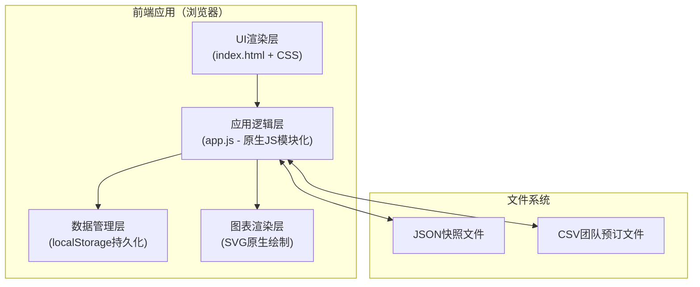

## 1. 架构设计



## 2. 技术说明

- **前端**：原生 HTML5 + CSS3 + 原生 JavaScript（ES2020），无任何框架依赖
- **构建工具**：Vite（作为开发服务器与打包工具，零配置原生JS支持）
- **后端**：无后端，所有数据存储于浏览器 localStorage，文件导入导出通过 File API
- **数据持久化**：localStorage 存储实时状态，JSON 文件导出/导入作为备份
- **图表**：原生 SVG 绘制折线图与热力图，无需 Chart.js 等第三方库

## 3. 路由定义

单页面应用（SPA），通过哈希路由实现页面切换：

| 路由（hash） | 页面 |
|-------------|------|
| #/dashboard | 主仪表盘 - 房态管理 |
| #/pricing | 动态定价设置 |
| #/reports | 收益报告与热力图 |
| #/data | 数据管理（快照/导入） |

## 4. 数据模型

### 4.1 核心数据结构

```javascript
// 房型枚举
const RoomTypes = {
  SINGLE: 'standard_single',      // 标准单人间
  DOUBLE: 'standard_double',      // 标准双人间
  SUITE: 'luxury_suite',          // 豪华套房
  FAMILY: 'family_suite'          // 家庭套房
};

// 房间状态
const RoomStatus = {
  VACANT: 'vacant',               // 空闲
  OCCUPIED: 'occupied',           // 已入住
  RESERVED: 'reserved'            // 已预订未入住
};

// 房间对象
interface Room {
  id: string;                     // 房间编号，如 "S-01"
  type: RoomTypes;                // 房型
  number: number;                 // 同房型内序号 1-10
  status: RoomStatus;             // 当前状态
  guestName?: string;             // 客人姓名
  checkInDate?: string;           // 入住日期 YYYY-MM-DD
  checkOutDate?: string;          // 退房日期 YYYY-MM-DD
  nights?: number;                // 入住天数
  dailyRate?: number;             // 实际日房价
  bookingDate?: string;           // 预订日期
}

// 定价配置
interface PricingConfig {
  basePrices: Record<RoomTypes, number>;  // 各房型基础价
  peakSeasons: PeakSeason[];              // 旺季规则列表
  advanceDiscounts: AdvanceDiscount[];    // 提前预订折扣
  overbookingThreshold: number;           // 超订阈值，默认 0.05（5%）
}

interface PeakSeason {
  id: string;
  name: string;
  startDate: string;            // YYYY-MM-DD
  endDate: string;              // YYYY-MM-DD
  multiplier: number;           // 价格系数，如 1.3 表示上浮30%
}

interface AdvanceDiscount {
  daysAhead: number;            // 提前天数
  discountRate: number;         // 折扣率，如 0.9 表示9折
}

// 每日收益记录（用于趋势图）
interface DailyRevenue {
  date: string;                 // YYYY-MM-DD
  revenue: number;              // 当日收入
  occupiedRooms: number;        // 当日在住房间数
  soldRooms: number;            // 当日卖出间夜数
}
```

### 4.2 应用全局状态

```javascript
interface AppState {
  rooms: Room[];                          // 40间房的完整数组
  pricing: PricingConfig;                 // 定价配置
  revenueHistory: DailyRevenue[];         // 过去30天历史数据
  today: string;                          // 模拟的"今天"日期
}
```

### 4.3 localStorage 键

| Key | 说明 |
|-----|------|
| `hotel_rooms_state` | 所有房间状态数据 |
| `hotel_pricing_config` | 定价配置 |
| `hotel_revenue_history` | 收益历史数据 |
| `hotel_current_date` | 模拟当前日期 |

## 5. 模块划分

```
src/
├── index.html              # 主HTML，包含所有页面结构
├── css/
│   └── style.css           # 全部样式（CSS变量、布局、组件样式）
└── js/
    ├── app.js              # 入口，路由分发，初始化
    ├── state.js            # 状态管理（读写localStorage，订阅更新）
    ├── rooms.js            # 房间管理逻辑（入住、退房、超订检查）
    ├── pricing.js          # 动态定价计算引擎
    ├── revenue.js          # 收益指标计算
    ├── charts.js           # SVG图表绘制（折线图、热力图）
    ├── io.js               # 文件导入导出（CSV、JSON）
    └── ui.js               # UI渲染与事件绑定
```

## 6. 核心算法

### 6.1 动态定价公式

```
入住日单价 = 基础价 × 旺季系数（若入住日在旺季） × 提前预订折扣
提前预订折扣：提前≥14天→0.85，提前≥7天→0.9，否则→1.0
订单总价 = Σ(每日单价) for 入住日 to 退房日前一天
```

### 6.2 超额预订检查

```
某房型当前占用率 = (已预订+已入住房间数) / 10
允许超订上限 = 10 × (1 + 5%) = 10.5 → 实际允许10间（向上取整边界）
当某房型已预订数 ≥ 10 时，标记超订风险，禁止新增该房型预订
```

### 6.3 收益指标

```
入住率 = 今日在住房间数 / 总房数(40)
ADR（平均房价） = 今日房费总收入 / 今日卖出间夜数
RevPAR（每间可售房收入） = 今日房费总收入 / 总房数(40)
                 = ADR × 入住率
```
